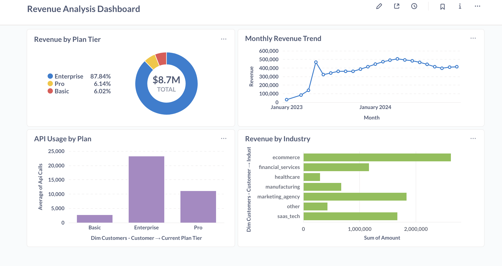

# SaaS Analytics Pipeline

An end-to-end data engineering project that generates synthetic SaaS data, processes it through an ETL pipeline, and creates analytics dashboards.

## What This Project Does

Simulates a SaaS analytics platform (like Mixpanel) with:
- 1,000 customers across 5 behavioral types
- 24 months of subscription, usage, and billing data
- Complete ETL pipeline loading data into PostgreSQL
- Interactive dashboard showing revenue and customer insights

## Technology Stack

- **Python 3.13** - Data generation and ETL
- **PostgreSQL** - Data warehouse
- **pandas & SQLAlchemy** - Data processing
- **Metabase** - Dashboards

## Project Structure
```
saas_analytics_pipeline/
├── config/              # Business rules and customer archetypes
├── core/                # Data simulation engine
├── generators/          # Customer and subscription generators
├── etl/                 # ETL pipeline with data quality checks
├── simulation_output/   # Generated CSV files
└── main.py             # Run everything
```

## Quick Start

1. **Clone and setup**
```bash
git clone https://github.com/YOUR_USERNAME/saas-analytics-pipeline.git
cd saas-analytics-pipeline
python -m venv venv
source venv/bin/activate
pip install -r requirements.txt
```

2. **Configure database**
```bash
# Create .env file with your PostgreSQL credentials
echo "DB_USER=your_username" > .env
echo "DB_PASSWORD=your_password" >> .env
echo "DB_HOST=localhost" >> .env
echo "DB_PORT=5432" >> .env
echo "DB_NAME=saas_analytics" >> .env
```

3. **Run the pipeline**
```bash
python main.py              # Generate data
python test_load.py         # Load dimensions
python test_load_facts.py   # Load facts
python test_quality.py      # Validate data
```

## Data Model

**Star Schema with:**
- `dim_customers` - 1,000 customers with attributes
- `dim_plans` - Basic, Pro, Enterprise tiers
- `dim_date` - Date dimension
- `fact_subscriptions` - 2,532 subscription events
- `fact_usage` - 60K+ API usage records
- `fact_billing` - 16K+ transactions ($8.7M revenue)

## Customer Types

1. **Steady Growers (30%)** - Consistent, reliable revenue
2. **Seasonal Business (25%)** - Q4/Q1 usage spikes
3. **Enterprise Pilots (15%)** - High growth or quick churn
4. **Price Sensitive (20%)** - Stay on Basic tier
5. **Failed Adoption (10%)** - Churn within 60 days

## Key Insights

- Enterprise tier drives 88% of revenue
- 48.5% overall churn rate
- Steady Growers have highest LTV
- Enterprise customers use 10x more API calls than Basic

## Dashboard Preview



The dashboard shows:
- Revenue by plan tier and customer type
- Monthly revenue trends
- Churn analysis
- API usage patterns
- Top customers

## Author

John Washburn

## License

MIT License
